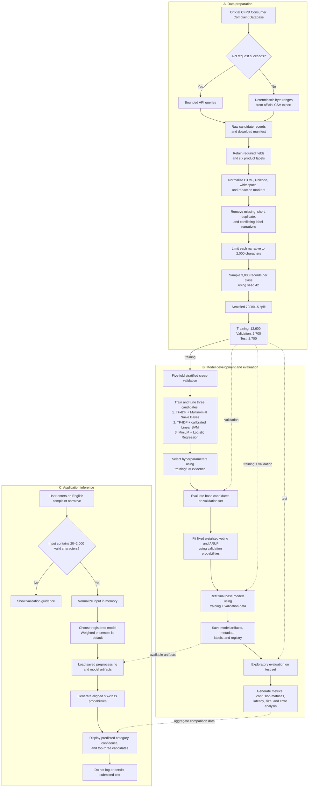

# ComplaintCompass Report-Writing Plan

## 1. Purpose and central argument

Write the report as an evidence-led account of **ComplaintCompass: Comparative NLP for Automated Consumer Financial Complaint Routing**. The report should make one coherent argument:

> Consumer financial complaints can be routed into six CFPB product categories with useful accuracy, but model choice involves a trade-off between predictive performance, speed, size, and evidential strength. The validation-weighted ensemble is the evidence-selected application default, while the implemented Adaptive Reliability-Uncertainty Fusion (ARUF) algorithm is a competitive exploratory result rather than a confirmed improvement.

Every technical claim should be supported by one of the following:

- a scholarly or official source;
- a reproducible project artifact;
- a table, figure, or diagram generated from project results; or
- a clearly labelled interpretation by the author.

Do not overstate the system as production-ready. It is an academic, English-only routing prototype and must not be presented as judging complaint merit or making financial, legal, or regulatory decisions.

## 2. Required document order

Follow the supplied template in this order:

1. Cover page and team information
2. Introduction
3. Related Work
4. Methodology
5. Result & Discussion
6. Conclusion
7. Reference & Source

Retain only the correct course code before submission. Complete the session, programme, tutorial group, tutor, project title, and student details exactly as requested by the template. If this remains an individual project, remove unused team-member rows only if the lecturer permits it.

The template does not state a word count. Confirm any word/page limit in the assignment instructions before drafting, then allocate space proportionally using the section priorities below.

## 3. Section-by-section blueprint

### 3.1 Introduction

#### Background

Explain the setting before describing the implementation:

- Introduce the operational problem of manually routing high-volume consumer financial complaint narratives.
- Introduce text classification as the relevant NLP task.
- Identify the CFPB Consumer Complaint Database as the study context and explain why six product categories are used.
- Briefly introduce ComplaintCompass and its comparative approach: Naive Bayes, calibrated Linear SVM, MiniLM embeddings with Logistic Regression, and ARUF.
- State the intended user and boundary: routing assistance for an analyst or evaluator, with human responsibility retained.

Use the project framing in `README.md`, `docs/nlp-implementation-plan.md`, and `docs/dataset-card.md`, but rewrite it as a connected academic narrative rather than copying documentation text.

#### Problem Statement

Use a three-part structure:

1. **What the problem is:** complaint narratives must be assigned to appropriate product categories, and manual triage can be slow and inconsistent.
2. **Why it matters:** incorrect routing can delay handling and reduce the usefulness of complaint-management workflows.
3. **What must be investigated:** whether different NLP representations can classify the six selected categories reliably, and which model offers the best practical balance of performance, latency, size, and transparency.

Avoid unsupported claims about actual CFPB staffing, cost savings, or production impact.

#### Objectives/Aims

State measurable objectives. Recommended wording and order:

1. Build a reproducible, balanced six-class dataset from public CFPB complaint narratives.
2. Implement and tune three complementary NLP classifiers under one evaluation protocol.
3. Implement and assess ARUF as an adaptive reliability-, uncertainty-, and agreement-aware probability-fusion algorithm.
4. Compare models using macro-F1 as the primary measure, supported by accuracy, macro precision, macro recall, weighted F1, per-class results, latency, and artifact size.
5. Develop a Streamlit prototype that returns a predicted category, calibrated confidence, and top-three candidates without storing submitted text.
6. Analyse errors, limitations, ethical risks, and the suitability of each model for the intended academic routing scenario.

#### Significance / Contribution of the Study

Explain the contribution at three levels:

- **Practical:** a functioning complaint-routing demonstration with transparent model comparison.
- **Methodological:** a fair comparison of sparse lexical, transformer-embedding, and ensemble approaches on the same deterministic split.
- **Educational/reproducibility:** manifests, checksums, saved artifacts, automated tests, and a repeatable command-line workflow.

Do not claim a novel algorithm. The contribution is the controlled comparison, reproducible implementation, application integration, and critical evaluation.

### 3.2 Related Work

#### Review of previous studies

Organise the literature by ideas rather than summarising one paper per paragraph:

1. Automated complaint classification and routing.
2. TF-IDF with probabilistic and linear classifiers for text classification.
3. Sentence-transformer embeddings for semantic text classification.
4. Probability calibration and soft-voting ensembles.
5. Evaluation of multiclass systems, especially macro-F1 for class-balanced treatment.

For each theme, compare methods, data, evaluation design, findings, and limitations. End paragraphs by explaining how the cited work informs a specific ComplaintCompass design decision.

Prioritise peer-reviewed papers and official documentation. Use the CFPB website/API documentation for dataset facts and original papers or official technical documentation for algorithms and tools. Avoid citing tutorials when a primary source is available.

#### Research gap and justification for the current study

The template text includes this required subsection even though it is not visible as a separate item in the outline. Make it explicit in the report.

Frame the gap carefully:

- Prior work may report strong results for one representation, but those results may not reveal the operational trade-offs among sparse models, sentence embeddings, and ensembles under the same data split and metrics.
- Aggregate accuracy alone can conceal unequal class behaviour and practical costs such as inference latency and artifact size.
- A reproducible comparison tied to a usable prototype provides evidence that a model-only study does not.

Justify the study as a bounded comparative investigation. Do not claim that no prior study has ever compared these methods unless a systematic search supports that claim.

### 3.3 Methodology

Write this section so another student could reproduce the work without reading the source code.

#### System flowchart / activity diagram

Create one numbered figure titled **“ComplaintCompass training, evaluation, and inference workflow.”** Divide it into three visually distinct lanes: **data preparation**, **model development and evaluation**, and **application inference**. This prevents the reader from incorrectly assuming that the Streamlit application trains a model for every prediction.

Use the following as the diagram blueprint:

Render the diagram in a portrait viewport with the three sections stacked from top to bottom. Capture or export it at a width that fits one documentation page without horizontal scaling; aim for approximately 1,600–2,000 pixels wide for a PNG screenshot. Crop unused margins, retain a white or transparent background, and confirm that every label remains readable at normal page zoom.

If Mermaid is not accepted in the final Word document, recreate the same vertical topology using Word shapes, draw.io, Lucidchart, or another vector-diagram tool. Keep the three stacked sections, decision diamond, record counts, and arrow labels. Export as SVG when possible, or as a high-resolution PNG if the report workflow requires a screenshot.

The diagram should make these distinctions explicit:

- **Two collection routes, one dataset contract:** the API is attempted first; deterministic byte ranges from the official CSV export are a fallback, not a second dataset.
- **Training, validation, and test have different roles:** training supports fitting and cross-validation; validation supports model comparison and ensemble weighting; test supports the final exploratory benchmark.
- **All models share the same processed records and split:** this is what makes the comparison fair.
- **The ensemble consumes aligned probabilities:** it combines the three base-model outputs rather than transforming raw text independently.
- **Final artifacts are created before application use:** the Streamlit application loads saved artifacts and never retrains at startup.
- **Inference is local and non-persistent:** submitted text is normalized and classified in memory without being logged or saved.
- **The weighted ensemble is the default:** it has the highest validation macro-F1; its test score is still described as exploratory because the broader combination analysis is post-hoc.

Immediately after the figure, explain the workflow in three short paragraphs:

1. **Data preparation paragraph:** describe the source/fallback decision, cleaning, deduplication, class balancing, deterministic seed, and stratified split. Reference the download and processed-data manifests.
2. **Model-development paragraph:** describe shared data, five-fold stratified cross-validation, model-specific tuning, validation-based ensemble weighting, refitting, artifact storage, and metric generation.
3. **Inference paragraph:** trace a single complaint from input validation through normalization, registered-model loading, probability generation, and presentation of the predicted and alternative categories.

Add a note beneath the figure stating that the original base-model test results had already been inspected before the combination analysis. Both combination methods use validation data, but the expanded five-model test comparison must still be described as exploratory because the broader analysis was defined post-hoc.

#### Description and analysis of dataset

Report the following concrete details from `docs/dataset-card.md` and `data/processed/dataset_manifest.json`:

- source: official CFPB Consumer Complaint Database;
- fields: complaint ID, date received, narrative, and product;
- collection period: 1 August 2023 to 31 December 2025;
- six target product labels;
- cleaning: HTML/Unicode/whitespace normalization, redaction handling, minimum 20 characters, maximum 2,000 characters, exact-duplicate removal, and removal of conflicting-label duplicates;
- deterministic sample: 3,000 records per class using seed 42;
- final total: 18,000 records;
- split: 12,600 train, 2,700 validation, and 2,700 test records;
- dataset checksum for reproducibility;
- known selection, geographic, language, verification, privacy, and truncation limitations.

Include a class/split-count table. Add only aggregate descriptive charts; do not reproduce raw complaint narratives because they may contain sensitive or identifying context even after source scrubbing.

Clarify that the test set was originally sealed, but its results were viewed before ARUF was defined. Therefore, the later five-method test comparison is exploratory rather than a fresh confirmatory test.

#### Algorithm selection & description of algorithms

Use a consistent mini-structure for each model: representation, classifier, tuned hyperparameters, reason for inclusion, strengths, and expected limitations.

1. **Multinomial Naive Bayes:** TF-IDF word unigrams/bigrams; baseline; tune `alpha` over 0.1, 0.5, and 1.0.
2. **Calibrated Linear SVM:** TF-IDF word unigrams/bigrams; strong sparse-text classifier with calibrated probabilities; tune `C` over 0.5, 1.0, and 2.0.
3. **MiniLM + Logistic Regression:** `all-MiniLM-L6-v2` sentence embeddings followed by Logistic Regression; semantic representation; tune `C` over 0.5, 1.0, and 2.0.
4. **Weighted ensemble:** align the three probability matrices and select positive global soft-voting weights on a 0.05 validation grid.
5. **ARUF:** align probabilities from the three base models; weight them by per-class validation F1 and per-input entropy-derived confidence; apply a bounded agreement multiplier; and select `alpha`, `beta`, and `gamma` using validation macro-F1, class-order-safe log loss, and deterministic tie-breaking.

Explain five-fold stratified cross-validation, hyperparameter selection on training data, combination fitting on validation probabilities from training-only base models, and final refitting of base models on training plus validation data. State that the highest validation macro-F1 determines the default, with size and latency used only for exact ties. The weighted ensemble is the default and also has the highest exploratory test macro-F1.

#### Evaluation metrics

Define each metric before presenting results:

- **Macro-F1 (primary):** gives equal importance to all six classes.
- **Accuracy:** overall proportion classified correctly.
- **Macro precision and recall:** class-balanced error perspectives.
- **Weighted F1:** performance weighted by class support.
- **Per-class precision, recall, and F1:** reveals category-specific behaviour.
- **Confusion matrix:** shows which category pairs are mistaken for one another.
- **Mean inference latency and artifact size:** practical deployment trade-offs.
- **Cross-validation mean and standard deviation:** training-stage stability.
- **Multiclass log loss:** used as part of ARUF parameter-selection tie-breaking.

Include formulas for the core classification metrics and define all symbols. State the evaluation sample size and avoid reporting more decimal places than are meaningful; four decimal places for scores and two for milliseconds are sufficient.

### 3.4 Result & Discussion

#### Results

Present evidence before interpretation. Recommended order:

1. A model-comparison table derived from `reports/model_comparison.csv`.
2. A validation/CV table containing selected hyperparameters and validation macro-F1.
3. The five confusion-matrix figures from `reports/`.
4. A compact per-class comparison, focusing on the default model and the most informative differences.
5. Optional interface screenshots showing valid input, prediction, top-three candidates, model comparison, and limitations.

The central exploratory test results are:

| Model | Macro-F1 | Accuracy | Mean latency | Artifact size |
|---|---:|---:|---:|---:|
| Weighted ensemble | 0.8513 | 0.8511 | 20.71 ms | 120.67 MiB |
| Linear SVM | 0.8458 | 0.8456 | 2.22 ms | 25.46 MiB |
| ARUF | 0.8363 | 0.8363 | 24.45 ms | 120.67 MiB |
| MiniLM + Logistic Regression | 0.8147 | 0.8148 | 18.09 ms | 87.37 MiB |
| Naive Bayes | 0.7524 | 0.7581 | 0.51 ms | 7.84 MiB |

Label this table **exploratory test benchmark** because the combination analysis was completed after the original test results had been inspected. Report that the target macro-F1 of at least 0.75 was met by all five evaluated methods, but do not treat this threshold alone as proof of real-world fitness.

#### Discussion/Interpretation

Answer the objectives rather than repeating the table:

- Explain why ARUF improved on MiniLM and Naive Bayes but remained 0.0095 macro-F1 below Linear SVM; a new algorithm is not guaranteed to outperform its strongest member.
- Explain why the weighted ensemble is the required evidence-selected default: highest validation macro-F1 and highest exploratory test macro-F1. Contrast this with Linear SVM's much lower latency and smaller artifact.
- Contrast Naive Bayes's speed and small size with its lower macro-F1 and uneven class recall.
- Explain that MiniLM's semantic representation did not outperform the tuned sparse Linear SVM on this bounded task, while carrying higher latency and storage cost.
- Analyse the strongest and weakest class behaviours using the confusion matrices. Mortgage is consistently strongest; checking/savings and credit-card complaints are a recurring confusion pair for the default model.
- Discuss likely causes: overlapping vocabulary, multi-product narratives, explicit product terms, truncation, and source-specific language.
- Separate observation from explanation. Use wording such as “the confusion matrix shows…” for results and “a plausible explanation is…” for interpretation.

Do not include raw error narratives in the report. If examples are essential, paraphrase or construct synthetic examples and label them accordingly.

### 3.5 Conclusion

#### Achievements

Use one short paragraph per objective, stating the evidence that shows whether it was achieved. Summarise:

- the reproducible balanced dataset;
- the three trained base approaches and implemented ARUF algorithm;
- the achieved performance relative to the target;
- the working Streamlit interface;
- the reproducibility, testing, privacy, and documentation controls.

End with a measured overall conclusion: the project demonstrates technically useful routing performance in the studied setting, with the weighted ensemble selected for predictive performance and Linear SVM remaining the efficient alternative.

#### Limitations and Future Works

Pair each limitation with a concrete future action:

| Limitation | Future work |
|---|---|
| US-specific, opt-in CFPB narratives | Validate on another complaint source and time period |
| English-only model | Add language detection and independently evaluated multilingual models |
| Six-class subset | Expand the taxonomy with hierarchical classification |
| Post-hoc ensemble comparison | Collect or preserve a new untouched holdout for confirmatory evaluation |
| Aggregate metrics may hide drift | Add time-sliced and subgroup-safe monitoring where appropriate |
| Possible reliance on explicit product words | Run masking/ablation tests and ambiguous-text evaluation |
| Fixed 2,000-character truncation | Compare truncation strategies or long-context representations |
| No production validation | Conduct human-in-the-loop usability, calibration, robustness, and drift studies |

Also acknowledge source selection bias, unverified narratives, possible residual privacy risk, distribution shift, confidence misinterpretation, and the absence of a demonstrated causal operational benefit.

### 3.6 Reference & Source

Create two clearly labelled groups if the lecturer accepts subheadings:

1. **Dataset and development sources:** official CFPB dataset/API page, Python, scikit-learn, Sentence Transformers/MiniLM, Streamlit, and other material tools actually used.
2. **Academic references:** every article, paper, book, or authoritative source cited in the body.

Use APA style consistently and ensure every in-text citation has one reference-list entry and vice versa. Include URLs/DOIs where APA requires them. Do not cite generated project files as if they were external scholarship; refer to them in the prose as implementation artifacts.

## 4. Planned tables and figures

Use a small set of purposeful visuals, each numbered, captioned, and discussed in the body:

| Item | Content | Source |
|---|---|---|
| Figure 1 | End-to-end training and inference flowchart | Create from the implemented workflow |
| Table 1 | Six labels and train/validation/test counts | `data/processed/dataset_manifest.json` |
| Table 2 | Model representations, classifiers, and tuned parameters | `docs/model-card.md`, training metadata |
| Table 3 | Validation and cross-validation results | `reports/validation_metrics.json` |
| Table 4 | Exploratory test performance, latency, and size | `reports/model_comparison.csv` |
| Figures 2–5 | Confusion matrices for all models | `reports/confusion_matrix_*.png` |
| Table 5 | Key errors/trade-offs by model | metrics plus aggregate error analysis |
| Optional figures | Streamlit input, prediction, comparison, and limitations views | running application |

Do not add a chart when the same point is clearer in a compact table. Never insert a figure without referring to it and interpreting its relevance.

## 5. Evidence map for drafting

Use these repository artifacts as the source of truth:

- Project scope and commands: `README.md`
- Frozen methodology: `docs/nlp-implementation-plan.md`
- Dataset facts and limitations: `docs/dataset-card.md`
- Model rationale, metrics, and limitations: `docs/model-card.md`
- Exact split and checksum: `data/processed/dataset_manifest.json`
- Collection provenance: `data/raw/download_manifest.json`
- Validation and CV evidence: `reports/validation_metrics.json`
- Exploratory test evidence: `reports/test_metrics.json`
- Compact comparison: `reports/model_comparison.csv`
- Error patterns: `reports/error_samples_*.csv` and confusion matrices
- Saved model configuration: `artifacts/models/*/metadata.json` and `artifacts/registry.json`
- Implementation evidence: `complaint_compass/`, `app.py`, and `tests/`

When two files disagree, investigate and resolve the discrepancy before writing. Prefer generated manifests/metrics for numeric facts and code/configuration for implemented behaviour.

## 6. Drafting sequence

1. Confirm submission rules, author details, word limit, and required course code.
2. Freeze the evidence by rerunning the test suite and confirming that reports/manifests match the final code.
3. Build the system flowchart and results tables first.
4. Draft Methodology directly from the frozen implementation and artifacts.
5. Draft Results using only generated outputs; keep interpretation out of this subsection.
6. Draft Discussion by answering each objective and explaining observed trade-offs.
7. Complete a focused literature search, then draft Related Work and the research gap.
8. Draft Introduction after the argument and evidence are stable.
9. Draft Conclusion last, mapping achievements back to the stated objectives.
10. Complete and cross-check the APA reference list.
11. Perform technical, citation, formatting, and integrity checks before submission.

## 7. Writing and presentation rules

- Use formal, precise academic language and define acronyms at first use.
- Prefer claims with specific subjects and evidence over vague claims such as “the model performs well.”
- Use past tense for completed project actions and present tense for established facts or what a figure shows.
- Keep Results factual and move explanations, implications, and speculation into Discussion.
- Use consistent model names and class labels throughout.
- Round consistently and include units for latency and storage.
- Number all headings, tables, figures, equations, and appendices consistently.
- Give every table and figure a descriptive caption and cite it in the surrounding text.
- Avoid first-person plural if there is only one contributor unless institutional style requires it.
- Do not expose raw complaint narratives, personal data, local absolute paths, or private credentials.
- Paraphrase sources genuinely; quotation and citation do not substitute for original synthesis.

## 8. Final quality checklist

### Template compliance

- [ ] Correct course code remains; unused codes are removed.
- [ ] Cover page and all student fields are complete.
- [ ] Every required main section and subsection is present.
- [ ] Research gap and justification subsection is included.

### Technical accuracy

- [ ] Dataset dates, counts, labels, seed, split, and checksum match the manifest.
- [ ] Model names, features, hyperparameters, and evaluation protocol match the implementation.
- [ ] Validation, cross-validation, and exploratory test results are clearly distinguished.
- [ ] Ensemble test results are labelled exploratory/post-hoc.
- [ ] The weighted ensemble is explained as the validation-selected application default, while Linear SVM is presented as the efficient alternative.
- [ ] Tables and figures can be regenerated from the final repository state.
- [ ] Limitations and ethical boundaries are explicit.

### Evidence and APA

- [ ] Every external factual or scholarly claim is cited.
- [ ] Every in-text citation appears in the reference list and vice versa.
- [ ] Dataset and development-tool sources are included.
- [ ] APA formatting is consistent.
- [ ] No fabricated, unverified, or placeholder citation remains.

### Editorial and submission QA

- [ ] Objectives, results, discussion, and conclusion align one-to-one.
- [ ] Results are not duplicated unnecessarily across text, tables, and figures.
- [ ] Captions, cross-references, page numbers, and heading levels are correct.
- [ ] Spelling, grammar, decimal precision, terminology, and formatting are consistent.
- [ ] The final exported document is visually inspected page by page.
