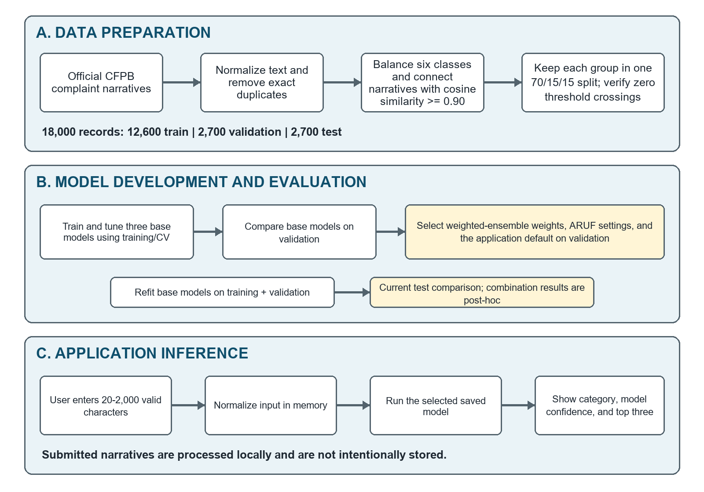
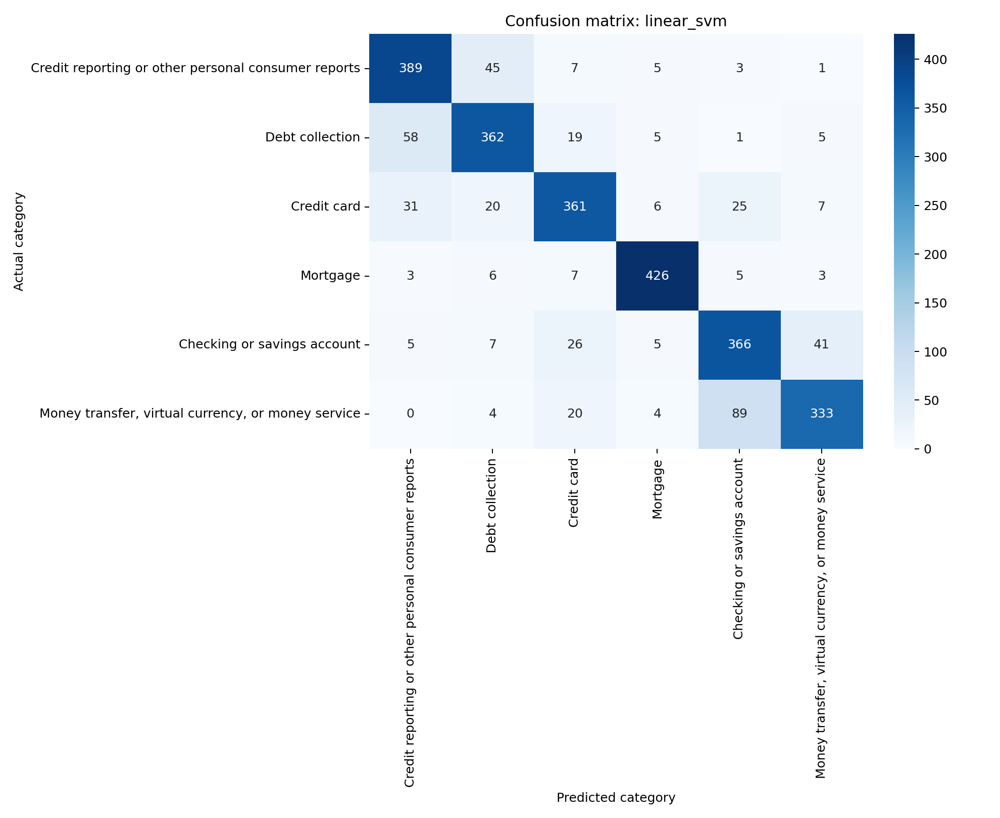
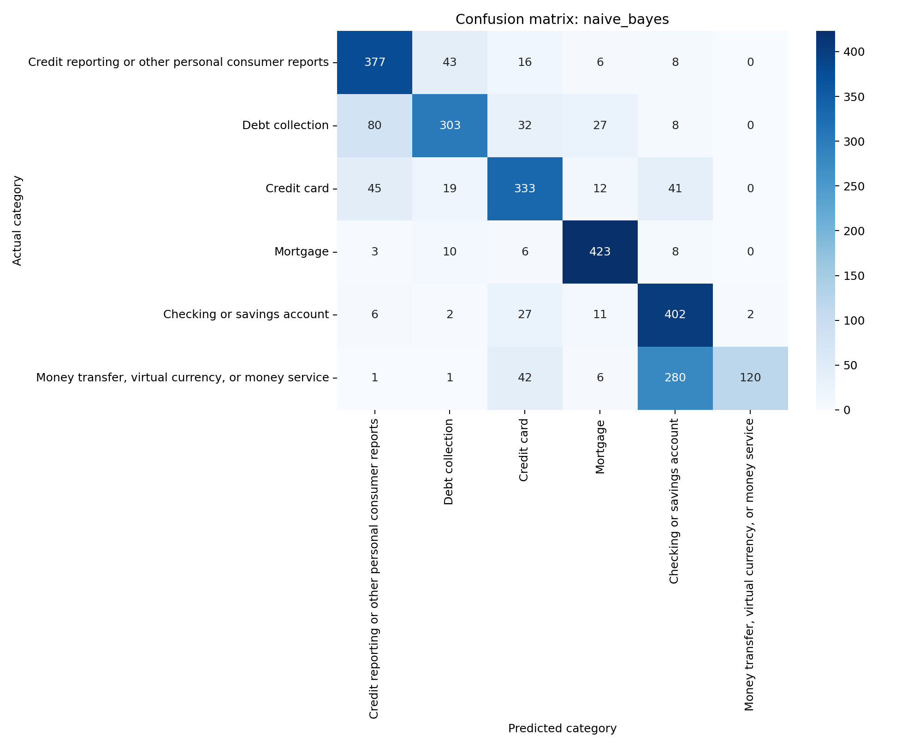
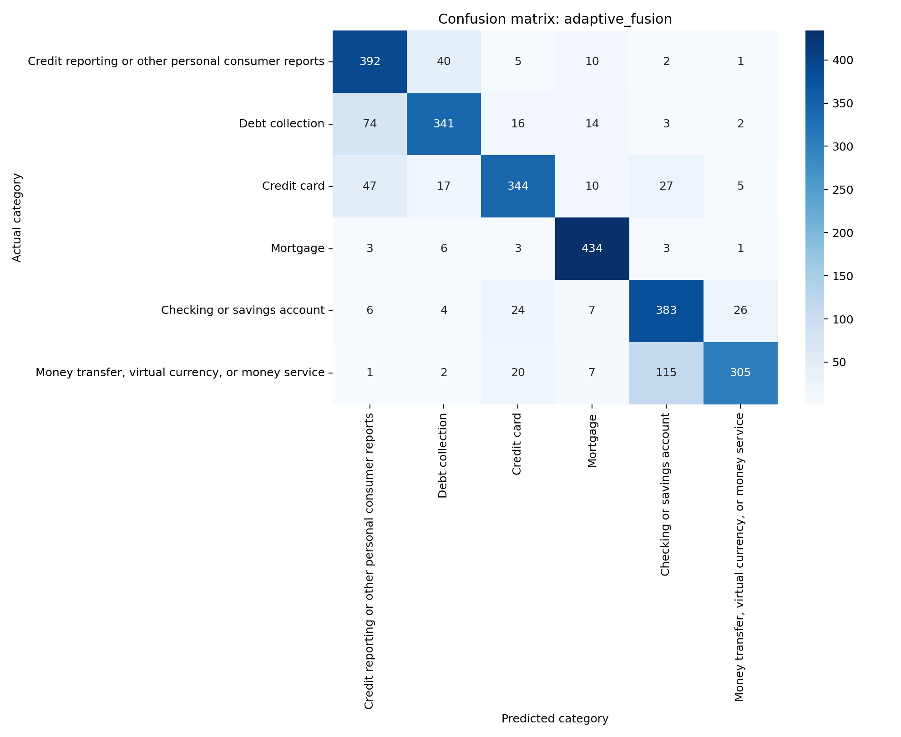

# Assignment Documentation

**Session:** 202605, Year 2026/27

**Project title:** ComplaintCompass: Comparative NLP for Automated Consumer Financial Complaint Routing

**Programme:** [PROGRAMME]

**Tutorial group:** [TUTORIAL GROUP]
**Tutor:** [TUTOR]

## Team members

| No. | Student name | Student ID | Module / contribution | Signature and date |
|---:|---|---|---|---|
| 1 | [STUDENT 1 NAME] | [STUDENT 1 ID] | Naive Bayes; joint ensemble/ARUF work | [SIGNATURE / DATE] |
| 2 | [STUDENT 2 NAME] | [STUDENT 2 ID] | Linear SVM; joint ensemble/ARUF work | [SIGNATURE / DATE] |
| 3 | [STUDENT 3 NAME] | [STUDENT 3 ID] | MiniLM + LR; joint ensemble/ARUF work | [SIGNATURE / DATE] |

# Introduction

## Background

Consumer complaint narratives are unstructured accounts that must be converted into actionable routing information before downstream review can begin. Natural language processing (NLP) frames this requirement as supervised multiclass text classification: a model receives a narrative and assigns one label from a predefined product taxonomy. The Consumer Financial Protection Bureau (CFPB) makes complaint data available for public use and notes that published narratives are consumers' own descriptions, shared only when consumers opt in and after steps to remove personal information (Consumer Financial Protection Bureau \[CFPB\], 2026). These characteristics make the database useful for an academic routing study while also requiring caution about privacy, representativeness, and verification.

ComplaintCompass is an English-language academic prototype that compares complementary representations under one deterministic evaluation protocol. The three base approaches are term frequency-inverse document frequency (TF-IDF) word unigrams and bigrams with Multinomial Naive Bayes; the same sparse representation with a calibrated Linear Support Vector Machine (SVM); and all-MiniLM-L6-v2 sentence embeddings with Logistic Regression. Two combination methods are assessed separately: a validation-weighted soft-voting ensemble combines the three predicted-probability vectors using fixed global weights, while Adaptive Reliability-Uncertainty Fusion (ARUF) adapts their influence using validation-derived class reliability, per-input uncertainty, and prediction agreement. The application is intended to assist an analyst or evaluator by showing a predicted category, model confidence, and three leading candidates. It does not judge complaint merit, determine legal or financial outcomes, or replace accountable human review.

The study therefore investigates whether complementary lexical and semantic approaches can support six-product complaint routing and whether probability combination improves the trade-off among classification performance, response time, stored model size, interpretability, and evaluation strength. Detailed numerical findings are reserved for the Results and Discussion section.

## Problem Statement

The immediate problem is to assign complaint narratives to the appropriate product category. Manual triage can be slow and inconsistent because narratives vary in length, terminology, and clarity, and a single narrative may refer to more than one financial product. Incorrect routing can delay handling and reduce the usefulness of complaint-management workflows. The investigation therefore asks whether sparse lexical features, semantic sentence embeddings, and probability combination can classify a balanced six-product subset reliably, and which approach offers the best balance of macro-F1, latency, size, transparency, and evidential strength. No claim is made about CFPB staffing levels, monetary savings, or realized production impact.

## Objectives/Aims

1. Build a reproducible, balanced six-class dataset from public CFPB complaint narratives.
2. Implement and tune three complementary NLP classifiers under a common data split and evaluation protocol.
3. Implement and assess a weighted ensemble and ARUF, while treating both combination-method test results as exploratory because the original holdout had already been inspected.
4. Compare models using macro-F1 as the primary measure, supported by accuracy, macro precision, macro recall, weighted F1, per-class results, latency, and stored model size.
5. Develop a Streamlit prototype that returns a predicted category, model confidence, and top-three candidates without intentionally storing submitted text.
6. Analyse errors, limitations, ethical risks, and model suitability for the bounded academic routing scenario.

## Significance / Contribution of the Study

Practically, the project supplies a functioning demonstration of complaint routing and a transparent model-comparison view. Methodologically, it places sparse lexical and transformer-derived semantic representations on the same processed records and deterministic split, avoiding comparisons confounded by different samples or metrics. ARUF is a project-specific composition of established reliability weighting, entropy-based certainty, and classifier-agreement concepts; it is not presented as a globally novel learning algorithm. Reproducibility is supported by recorded data sources, split counts, a dataset checksum, saved model settings, repeatable evaluation commands, and automated tests. The contribution is the controlled comparison, reproducible implementation, application integration, and critical interpretation of trade-offs.

# Related Work

## Review of previous studies

Automated complaint classification sits within the broader field of supervised text categorization. Joachims (1998) showed why maximum-margin methods are well suited to sparse, high-dimensional text, while McCallum and Nigam (1998) compared event models for Naive Bayes and found the multinomial formulation particularly effective with larger vocabularies. These foundations motivate the two TF-IDF pipelines in ComplaintCompass: Naive Bayes as a computationally economical probabilistic baseline and Linear SVM as a stronger margin-based classifier. Their inclusion also provides a meaningful test of whether a modern sentence representation is necessary for this bounded taxonomy.

Financial complaint research has increasingly treated narrative text as a classification resource. Miranda, Kohnecke, and Renard (2023) used a 2022 snapshot of CFPB narratives as features in a benchmark that predicted the hierarchical product and sub-product labels. They reported higher hierarchical F-scores for the evaluated local hierarchical approaches than for their corresponding flat classifiers. More recent bilingual work by Jain et al. (2026) compared TF-IDF-based models with a fine-tuned XLM-RoBERTa model on a balanced synthetic English-Hindi dataset derived from CFPB complaints; the transformer achieved the highest reported accuracy. These studies are not directly comparable to ComplaintCompass because their label structures, language conditions, sampling, representations, and evaluation designs differ. They nevertheless support the use of complaint narratives as predictive input and controlled comparisons between feature-based and contextual approaches.

Sentence-transformer models address a different representation question. Reimers and Gurevych (2019) introduced Sentence-BERT to produce semantically meaningful fixed-size sentence embeddings more efficiently than pairwise BERT inference. ComplaintCompass uses the compact all-MiniLM-L6-v2 encoder to represent each narrative, then learns a Logistic Regression decision boundary. This separates representation learning from task classification and offers a semantic alternative to exact lexical matching. However, pretrained semantic representations do not guarantee superior downstream performance: domain vocabulary, truncation, class boundaries, and the strength of a tuned sparse baseline all affect the result.

Probability calibration matters when numerical outputs are presented as confidence or combined across models. Maximum-margin outputs are not probabilities; cross-validated calibration maps decision values to the unit interval using predictions from data not used to fit each estimator (scikit-learn developers, 2026a). This procedure was applied to the Linear SVM. Standard weighted soft voting forms a linear pool of aligned class-probability vectors (Kittler et al., 1998), while validation-based ensemble selection is also established (Caruana et al., 2004; Large et al., 2019). However, combining member probabilities does not by itself prove that the weighted ensemble or ARUF output is calibrated. Because no reliability diagram or calibration metric was evaluated for either combination method, this report calls their outputs predicted probabilities or model confidence rather than calibrated confidence. ARUF adapts member influence using category-specific validation F1, entropy-derived input certainty, and model agreement. These ingredients are established ideas assembled for this application, not evidence of an unprecedented algorithm.

Evaluation must make class treatment explicit. Accuracy summarizes the proportion of correct decisions but can hide uneven class behavior. Macro averaging computes the arithmetic mean of per-class scores, giving each product equal weight, whereas weighted F1 scales each class by its support (scikit-learn developers, 2026b). Because this dataset is deliberately balanced, accuracy and macro recall are numerically close, yet macro-F1 remains the primary measure because it combines precision and recall at class level. Confusion matrices, per-class scores, inference latency, and stored size add diagnostic and practical evidence that a single aggregate score cannot provide.

## Research gap and justification for the current study

Prior work demonstrates both classical and contextual complaint classification, but isolated headline scores do not reveal the operational trade-offs among sparse models, fixed sentence embeddings, and adaptive probability fusion under the same records, split, metrics, and application interface. Furthermore, aggregate accuracy can conceal category-specific errors, while research prototypes may omit response time, stored model size, data provenance, or privacy behavior. ComplaintCompass addresses this bounded gap through a reproducible side-by-side comparison tied to a working prototype. It does not claim that these methods or ARUF's constituent ideas have never been used; rather, it asks which trade-off is defensible for this specific six-class, English-only CFPB routing scenario.

# Methodology

## System flowchart / activity diagram

{width=5.5in}

*Figure 1. ComplaintCompass training, evaluation, and inference workflow.*

Data preparation first attempted bounded requests to the official CFPB source. If the API route failed, deterministic byte ranges from the official CSV export served as a fallback rather than a second dataset. The pipeline retained complaint ID, date received, narrative, and product; normalized HTML, Unicode, whitespace, and redaction markers; removed missing, short, exact-duplicate, and conflicting-label narratives; truncated text to 2,000 characters; then sampled 3,000 records per class with seed 42. Word TF-IDF unigram/bigram cosine similarity was then used to connect narratives with similarity at least 0.90 into groups, and each complete group was assigned to one split. The processed data record documents the grouping settings, exact 70/15/15 stratified counts, and checksum.

Model development used five-fold stratified cross-validation on training data for model-specific tuning. The three base models were compared on the validation set, after which final versions were refitted on training plus validation data and saved with their labels and settings. Both combination methods use validation-stage probability outputs from base models fitted on training data only. The weighted ensemble selected fixed weights of 0.05, 0.65, and 0.30 for Naive Bayes, Linear SVM, and MiniLM respectively. ARUF derives per-model, per-class reliability from validation F1 and selected $\alpha=2.0$, $\beta=0.5$, and $\gamma=0.2$. The application model list, inference code, comparison metrics, error samples, and confusion matrices were then regenerated through the same evaluation pipeline.

At inference, an English narrative must contain 20 to 2,000 valid characters. The text is normalized in memory, the selected saved model is loaded, and its six-class predicted-probability vector is used to display the predicted category, model confidence, and top three candidates. The validation-weighted ensemble is the default because it had the highest validation macro-F1. The application code does not intentionally log or persist submitted narratives, although real deployment would still require independent security, telemetry, and privacy review.

> **Methodological note.** The original base-model test results had already been inspected before the combination analysis was completed. Although both combination methods use validation data rather than test labels, the five-model comparison on the existing test split is post-hoc and therefore exploratory rather than confirmatory. A later untouched or time-based holdout is required for confirmation.

## Description and analysis of dataset

The source is the official CFPB Consumer Complaint Database. The extraction period runs from 1 August 2023 through 31 December 2025, aligning with the current product taxonomy recorded in the project documentation. Four fields were retained: complaint ID, date received, consumer complaint narrative, and product. The six target products are shown in Table 1. Each contains 3,000 sampled records, so every class contributes 2,100 training, 450 validation, and 450 test observations.

| **Product label** | **Train** | **Validation** | **Test** | **Total** |
|----|----|----|----|----|
| Checking or savings account | 2,100 | 450 | 450 | 3,000 |
| Credit card | 2,100 | 450 | 450 | 3,000 |
| Credit reporting or other personal consumer reports | 2,100 | 450 | 450 | 3,000 |
| Debt collection | 2,100 | 450 | 450 | 3,000 |
| Money transfer, virtual currency, or money service | 2,100 | 450 | 450 | 3,000 |
| Mortgage | 2,100 | 450 | 450 | 3,000 |

*Table 1. Six product labels and deterministic split counts.*

Cleaning normalized HTML fragments, Unicode, whitespace, and CFPB redaction markers; rejected narratives shorter than 20 characters; limited accepted text to 2,000 characters; removed exact duplicates; and removed identical narratives associated with conflicting labels. Deterministic balanced sampling used seed 42. The sampled narratives were represented using word TF-IDF unigrams and bigrams (`min_df=1`, at most 100,000 features, sublinear term frequency and L2 normalization). Pairs with cosine similarity at least 0.90 were joined into transitive connected groups before splitting. A deterministic capacity-aware assignment kept every group in one split while preserving the exact per-class counts in Table 1. The final dataset contains 18,000 rows: 12,600 training, 2,700 validation, and 2,700 test. Its processed SHA-256 checksum is 8b23f49dba99f39a1a89ac2a9968dfb3d89ef399004a65145533f829ddd5091c.

The grouping pass produced 16,342 groups, including 278 groups containing more than one narrative; the largest connected group contains 571 narratives. The dataset record confirms that no group crosses a split. A separate nearest-neighbour audit using the same representation and threshold found zero validation-to-training, test-to-training, or test-to-validation pairs with similarity at least 0.90. The respective maximum similarities were 0.8997, 0.8983, and 0.8927. This resolves the material overlap detected in the previous split at the specified lexical threshold, and all models and results below were regenerated from the grouped split. The method remains a lexical screen rather than a complete semantic-duplicate detector, so semantically equivalent paraphrases below the threshold can still exist.

The dataset is not a statistical sample of all consumers. CFPB explains that published narratives are opt-in, complaint experiences are not independently verified, and complaint volume should not be interpreted without context (CFPB, 2026). The sample is US-specific and English-only, reflects a selected time period and six-class subset, may contain residual privacy-sensitive context, and truncates long narratives. Balancing supports equal-support model comparison but deliberately replaces the real CFPB product distribution with 3,000 examples per selected class. Consequently, performance and predicted-probability behaviour measured here may differ under real-world class prevalence; confidence values should not be interpreted as deployment probabilities without prevalence-aware calibration and external validation. These constraints limit external validity and prohibit interpreting the classifier as a measure of complaint merit, legal violation, or population harm.

## Algorithm selection & description of algorithms

| **Model** | **Representation / classifier** | **Tuning** | **Rationale and limitation** |
|----|----|----|----|
| Multinomial Naive Bayes | Word TF-IDF, 1-2 grams; `MultinomialNB` | $\alpha \in \{0.1, 0.5, 1.0\}$; selected $0.1$ | Fast, small probabilistic baseline; conditional-independence assumptions can produce uneven recall. |
| Calibrated Linear SVM | Word TF-IDF, 1-2 grams; `LinearSVC` + cross-validated calibration | $C \in \{0.5, 1.0, 2.0\}$; selected $0.5$ | Strong sparse-text margin classifier with probabilities; depends heavily on lexical evidence. |
| MiniLM + Logistic Regression | all-MiniLM-L6-v2 sentence embedding with a maximum sequence length of 256 tokens; Logistic Regression | $C \in \{0.5, 1.0, 2.0\}$; selected $2.0$ | Compact semantic representation; slower and larger, and generic semantics may not match product boundaries. |
| Weighted ensemble | Aligned probabilities from all three base models | Positive weights on a 0.05 grid; selected 0.05, 0.65, and 0.30 | Transparent fixed global combination; requires all three saved member models. |
| ARUF | Aligned probabilities from all three base models | $\alpha,\beta \in \{0.5,1,2\}$ and $\gamma \in \{0,0.05,0.10,0.20\}$; selected $\alpha=2.0$, $\beta=0.5$, $\gamma=0.2$ | Adapts model influence by class reliability, current uncertainty, and agreement; requires all three saved member models. |

*Table 2. Model representations, classifiers, tuned parameters, and roles.*

Five-fold stratified cross-validation preserved class proportions within each fold. Hyperparameters were selected using training/CV results; each selected candidate was then evaluated on validation data. The fixed ensemble weights and ARUF parameters were selected using the same three validation probability matrices without consulting test labels. Final base models were refitted on training plus validation data before the test benchmark. Because the validation set directly determined the ensemble weights, ARUF parameters, and application default, its scores are model-selection evidence rather than an independent estimate of final performance. The model with the highest validation macro-F1 is the application default; size and latency break exact ties only. The weighted ensemble therefore becomes the default, pending independent confirmation on a fresh holdout.

The shared 2,000-character preprocessing limit does not mean the sparse and transformer representations receive identical information. TF-IDF uses all tokens produced from the retained 2,000 characters. The saved all-MiniLM-L6-v2 sentence-transformer configuration applies its own WordPiece tokenization and a maximum sequence length of 256 tokens, truncating any remaining subword sequence beyond that limit before embedding. Long complaints can therefore contribute more of their retained text to TF-IDF than to MiniLM, which is a representation-specific limitation rather than a controlled equality of input coverage.

### Adaptive Reliability-Uncertainty Fusion

Let $M$ be the number of member models, $K$ the number of classes, and $p_{m,k}(x)$ the predicted probability assigned by model $m$ to class $k$ for input $x$. The Linear SVM member is explicitly calibrated; calibration was not separately established for every member or either fused output. All member probability columns are first aligned to the same fixed class order and normalized so that

$$
p_{m,k}(x) \ge 0,
\qquad
\sum_{k=1}^{K} p_{m,k}(x) = 1.
$$

The reliability of member $m$ for class $k$ is its validation-set class F1 score:

$$
r_{m,k}=F^{(\mathrm{val})}_{1,m,k}.
$$

ARUF measures a member's uncertainty for the current input with normalized entropy:

$$
H_m(x)
=
-\frac{1}{\log K}
\sum_{k=1}^{K} p_{m,k}(x)\log p_{m,k}(x),
$$

and converts it to an entropy-derived certainty factor:

$$
q_m(x)=\max\!\left(\varepsilon,\,1-H_m(x)\right),
$$

where $\varepsilon = 10^{-12}$ prevents zero-valued weights. The adaptive contribution weight is

$$
w_{m,k}(x)
=
\max(\varepsilon,r_{m,k})^{\alpha}
q_m(x)^{\beta}.
$$

Each model also casts one hard vote. For class $k$,

$$
v_k(x)
=
\sum_{m=1}^{M}
\mathbf{1}\!\left[
\operatorname*{arg\,max}_{j} p_{m,j}(x)=k
\right],
$$

and the agreement multiplier is

$$
a_k(x)
=
1+\gamma\max\!\left(v_k(x)-1,\,0\right).
$$

The unnormalized class score and final fused probability are

$$
s_k(x)
=
a_k(x)
\sum_{m=1}^{M} w_{m,k}(x)p_{m,k}(x),
$$

$$
\widehat{p}_k(x)
=
\frac{s_k(x)}{\sum_{j=1}^{K}s_j(x)},
\qquad
\widehat{y}(x)
=
\operatorname*{arg\,max}_{k}\widehat{p}_k(x).
$$

The parameters $\alpha$, $\beta$, and $\gamma$ are selected deterministically using validation predictions only. Candidates are ranked first by descending validation macro-F1, then by ascending multiclass log loss, distance from the neutral values $(\alpha,\beta)=(1,1)$, $\gamma$, $\alpha$, and $\beta$. Log loss is computed with an explicit class-to-column mapping so the fixed domain label order cannot be silently rearranged. ARUF is a project-specific fusion rule built from established ideas; the report does not claim global algorithmic novelty.

## Evaluation metrics

For class $k$, true positives $TP_k$ are correct assignments to $k$, false positives $FP_k$ are other complaints incorrectly assigned to $k$, and false negatives $FN_k$ are complaints of $k$ assigned elsewhere. With $N$ samples, $K=6$ classes, and indicator $\mathbf{1}[\cdot]$, the core measures are

$$
\operatorname{Precision}_k
=
\frac{TP_k}{TP_k+FP_k},
$$

$$
\operatorname{Recall}_k
=
\frac{TP_k}{TP_k+FN_k},
$$

$$
F_{1,k}
=
2\frac{\operatorname{Precision}_k\operatorname{Recall}_k}
{\operatorname{Precision}_k+\operatorname{Recall}_k},
$$

$$
\operatorname{MacroF1}
=
\frac{1}{K}\sum_{k=1}^{K}F_{1,k},
$$

and

$$
\operatorname{Accuracy}
=
\frac{1}{N}\sum_{i=1}^{N}
\mathbf{1}\!\left[y_i=\widehat{y}_i\right].
$$

Macro precision and macro recall average their per-class values equally; weighted F1 averages $F_{1,k}$ in proportion to class support. A confusion matrix records counts for every true/predicted class pair. Cross-validation mean and standard deviation describe training-stage stability. Mean per-item inference latency and stored model size characterize practical cost. Multiclass log loss is

$$
\mathcal{L}_{\mathrm{log}}
=
-\frac{1}{N}\sum_{i=1}^{N}
\log\widehat{p}_{y_i}(x_i),
$$

which penalizes probability assigned away from the true class and serves as ARUF's first tie-breaker after macro-F1. Validation and test samples each contain 2,700 observations; reported scores use four decimal places and latency uses two.

# Result & Discussion

## Results

Table 3 presents the training-stage and validation results. Linear SVM achieved the highest base-model cross-validation score, while the fixed weighted ensemble achieved the highest validation macro-F1. These validation values are the appropriate basis for model selection, but they are not independent final-performance estimates because the ensemble weights, ARUF parameters, and default choice were selected on this same set.

| **Model** | **Selected parameter** | **CV macro-F1 mean** | **CV SD** | **Validation macro-F1** | **Validation accuracy** |
|----|----|----|----|----|----|
| Weighted ensemble | NB = 0.05; SVM = 0.65; MiniLM = 0.30 | Not applicable | Not applicable | 0.8370 | 0.8363 |
| Linear SVM | C = 0.5 | 0.8396 | 0.0051 | 0.8337 | 0.8333 |
| ARUF | alpha = 2.0; beta = 0.5; gamma = 0.2 | Not applicable | Not applicable | 0.8104 | 0.8111 |
| MiniLM + LR | C = 2.0 | 0.8137 | 0.0015 | 0.7975 | 0.7970 |
| Naive Bayes | alpha = 0.1 | 0.7565 | 0.0065 | 0.6949 | 0.7119 |

*Table 3. Five-fold cross-validation and validation-set results (n = 2,700 validation records).*

Table 4 reports the complete evaluation rerun after similarity grouping and retraining. The three base models are listed separately from the two combination methods: the weighted ensemble uses global validation-selected weights, whereas ARUF adapts influence by class and input. Latency was measured in one environment and is therefore compared only within this run. The current test split has no cross-split pairs at or above the configured 0.90 similarity threshold. However, the earlier split's test results had already informed the project before this corrective re-split, so the new results remain post-hoc evidence rather than a fully independent final confirmation; a later time-based holdout is still required.

| **Model** | **Accuracy** | **Macro precision** | **Macro recall** | **Macro-F1** | **Latency (ms)** | **Size (MiB)** |
|----|----|----|----|----|----|----|
| Weighted ensemble | 0.8389 | 0.8411 | 0.8389 | 0.8385 | 21.47 | 120.66 |
| Linear SVM | 0.8285 | 0.8305 | 0.8285 | 0.8284 | 2.70 | 25.46 |
| ARUF | 0.8144 | 0.8220 | 0.8144 | 0.8133 | 35.12 | 120.66 |
| MiniLM + LR | 0.8030 | 0.8052 | 0.8030 | 0.8024 | 19.26 | 87.37 |
| Naive Bayes | 0.7252 | 0.7770 | 0.7252 | 0.7078 | 0.59 | 7.84 |

*Table 4. Five-method benchmark after grouped re-splitting and complete retraining ($n=2{,}700$). Results remain post-hoc rather than independent confirmation.*

Four of the five test macro-F1 values meet the project target of at least 0.75; Naive Bayes does not. This threshold is an internal success criterion, not evidence of real-world fitness. Figures 2-6 show the regenerated confusion matrices from the shared evaluation pipeline.

{width=5.8in}

*Figure 2. Weighted ensemble confusion matrix on the exploratory test set.*

{width=5.8in}

*Figure 3. Linear SVM confusion matrix on the exploratory test set.*

{width=5.8in}

*Figure 4. MiniLM + Logistic Regression confusion matrix on the exploratory test set.*

{width=5.8in}

*Figure 5. Naive Bayes confusion matrix on the exploratory test set.*

{width=5.8in}

*Figure 6. ARUF confusion matrix on the exploratory test set.*

| **Weighted-ensemble product** | **Precision** | **Recall** | **F1** | **Support** |
|----|----|----|----|----|
| Checking or savings account | 0.7597 | 0.8289 | 0.7928 | 450 |
| Credit card | 0.8413 | 0.8244 | 0.8328 | 450 |
| Credit reporting or other personal consumer reports | 0.7972 | 0.8733 | 0.8335 | 450 |
| Debt collection | 0.8349 | 0.7978 | 0.8159 | 450 |
| Money transfer, virtual currency, or money service | 0.8701 | 0.7444 | 0.8024 | 450 |
| Mortgage | 0.9435 | 0.9644 | 0.9538 | 450 |

*Table 5. Per-class performance of the default weighted ensemble on the exploratory test set.*

## Discussion/Interpretation

The first objective was achieved with a balanced, deterministic 18,000-record dataset, a stable checksum, exact 70/15/15 counts, and similarity groups confined to one split. The independent audit found no cross-split pair at or above the configured 0.90 lexical threshold. The second objective was achieved for the three base methods, which share one preprocessing and evaluation protocol. The third objective was achieved at prototype level: ARUF has deterministic fitting, class-order-safe log loss, saved real-data settings, application integration, automated coverage, and regenerated validation and test results. A later untouched holdout is still needed for independent confirmation.

ARUF exploited complementary lexical and semantic signals without assigning one fixed global weight to each model. Category reliability emphasized members where validation F1 was stronger, entropy reduced the influence of uncertain predictions, and the agreement multiplier reinforced classes selected by multiple members. ARUF improved test macro-F1 over MiniLM by 0.0108 and over Naive Bayes by 0.1055, but remained 0.0151 below Linear SVM. The result shows that adaptive fusion produced a competitive compromise but could not recover enough complementary correct decisions to surpass the strongest sparse model.

The weighted ensemble is the application default because it achieved the highest validation macro-F1 (0.8370), which is the stated model-selection rule. That value should not be read as an independent estimate of final performance because the ensemble weights were chosen on the same validation set. The ensemble also achieved the highest post-hoc test macro-F1 (0.8385), with 21.47 ms latency and a 120.66 MiB effective stored-model footprint. Linear SVM is the efficient alternative at 0.8284 macro-F1, 2.70 ms, and 25.46 MiB. ARUF uses the same three members but reached 0.8133 macro-F1 at 35.12 ms. The simpler fixed weighted ensemble therefore performed better than ARUF in this study; the additional adaptive mechanism was not superior.

Naive Bayes provides the smallest and fastest option at 7.84 MiB and 0.59 ms, but its 0.7078 macro-F1 falls below the project's 0.75 target. The confusion matrix shows highly uneven behaviour: mortgage recall is 0.9400, whereas money-transfer recall is 0.2667 despite 0.9836 precision. The model is consequently useful as a baseline or constrained-device option, not the strongest general router. Its conditional-independence assumptions and reliance on token frequency provide a plausible explanation for uneven class boundaries.

MiniLM's semantic representation did not outperform the tuned sparse Linear SVM. It achieved 0.8024 macro-F1 while requiring 87.37 MiB and 19.26 ms per item. This does not show that semantic embeddings are generally inferior; it shows that this compact generic encoder plus Logistic Regression was less effective on the selected labels and sample. Explicit product terminology and stable domain vocabulary may favour sparse word n-grams, while a fixed embedding can compress distinctions that matter for adjacent financial categories. Its 256-token sequence limit can also discard part of a long narrative that remains available to TF-IDF within the 2,000-character input. Fine-tuning, domain-adapted encoders, or longer-context strategies remain open tests.

The Linear SVM confusion matrix shows mortgage as the strongest class, with F1 = 0.9456. A plausible explanation is that mortgage narratives contain distinctive terms such as escrow, foreclosure, and loan servicing. Checking/savings and credit card form a recurring confusion pair: 26 checking/savings complaints were predicted as credit card, and 25 credit-card complaints were predicted as checking/savings. Shared language about transactions, fees, fraud, accounts, and disputed charges can blur the boundary. Money-transfer and checking/savings narratives also show directional confusion, potentially because narratives mention payments or account transactions across products. These explanations are hypotheses; masking explicit product terms and evaluating deliberately ambiguous synthetic cases would test them.

The fourth objective was met for all five methods through macro and per-class metrics, confusion matrices, latency, stored model size, and error samples. The fifth objective was met for the five-method Streamlit interface, which validates input and presents a prediction, model confidence, alternatives, and model comparison while defaulting to the highest-validation-macro-F1 method. The sixth objective is addressed through the documented limitations and privacy boundaries. These achievements demonstrate technically useful routing in the studied setting, not production readiness or causal operational benefit.

# Conclusion

## Achievements

ComplaintCompass created a balanced six-class corpus of 18,000 public CFPB narratives with deterministic sampling, a recorded seed, similarity-grouped stratification, and a processed checksum. The corrective pipeline keeps every ≥0.90 lexical-similarity component within one split, and the post-split audit found no cross-split pair meeting that threshold.

Three complementary base approaches were implemented, trained, and evaluated under one protocol: Multinomial Naive Bayes, calibrated Linear SVM, and MiniLM embeddings with Logistic Regression. The weighted ensemble and ARUF were implemented separately as combination methods that use the three aligned probability outputs. ARUF's selected settings and reliability matrix are saved for reproducibility.

Four methods met the internal 0.75 macro-F1 target on the grouped test split; Naive Bayes reached 0.7078 and did not. The weighted ensemble achieved the highest post-hoc test result (0.8385 macro-F1) and is the default because it also had the highest validation macro-F1. Linear SVM followed at 0.8284 with much lower operational cost, while ARUF reached 0.8133. The simpler weighted ensemble clearly outperformed ARUF in this study; greater algorithmic complexity did not produce better performance.

The Streamlit prototype loads saved models, validates a 20-2,000-character English input, and returns a category, model confidence, and top-three candidates. Reproducibility and privacy controls include saved model settings, recorded data checksums and split counts, repeatable metric files, local inference, and an explicit non-persistence design. Automated tests cover the fusion mathematics, deterministic selection, training and model reload, inference integration, and successful application classification.

Overall, the project demonstrates promising automated routing performance for the selected CFPB setting after correcting the known cross-split similarity problem. The validation-weighted ensemble is the default mainly because it has the highest validation macro-F1; its stronger test result is post-hoc support, not independent confirmation. Calibrated Linear SVM remains the substantially faster and smaller alternative. ARUF is a completed project-specific algorithm, but it performed below the simpler weighted ensemble. All methods still require evaluation on a later untouched or time-based holdout.

## Limitations and Future Works

| **Limitation** | **Concrete future work** |
|----|----|
| US-specific, opt-in CFPB narratives | Validate on another complaint source and a later time period. |
| English-only model | Add language detection and independently evaluated multilingual models. |
| Six-class flat subset | Expand the taxonomy and evaluate hierarchical classification. |
| Post-hoc weighted-ensemble and ARUF evaluation | Confirm both combination methods on a fresh untouched or time-based holdout. |
| Aggregate metrics may hide drift | Add time-sliced monitoring and carefully justified subgroup-safe analyses. |
| Possible reliance on explicit product words | Run masking/ablation tests and ambiguous-text evaluation. |
| Fixed 2,000-character truncation | Compare head-tail, salient-span, and long-context strategies. |
| Similar paraphrases below the 0.90 lexical threshold may remain | Compare multiple similarity representations and thresholds, and validate on a later time-based holdout. |
| Balanced classes differ from real prevalence | Evaluate on natural class frequencies and assess prevalence-aware probability calibration. |
| Unverified calibration of fused probabilities | Use reliability diagrams and multiclass calibration measures before calling ensemble or ARUF output calibrated. |
| No production validation | Conduct human-in-the-loop usability, calibration, robustness, security, privacy, and drift studies. |

*Table 6. Limitations paired with proposed future work.*

Additional limitations include source-selection bias, unverified one-sided narratives, possible residual privacy risk, changing product terminology, distribution shift, and the possibility that users misread model confidence as certainty. The balanced sample does not reflect real prevalence, latency measurements are environment-dependent, and no causal reduction in handling time or error has been demonstrated. Future evaluation should pre-register the analysis, preserve a genuinely untouched holdout, document the serving environment, and involve domain reviewers in defining acceptable errors and escalation rules.

# Reference & Source

## Dataset and development sources

Consumer Financial Protection Bureau. (2026). Consumer Complaint Database. https://www.consumerfinance.gov/data-research/consumer-complaints/

Python Software Foundation. (2026). Python language reference, version 3.11. https://docs.python.org/3/

scikit-learn developers. (2026a). Probability calibration. https://scikit-learn.org/stable/modules/calibration.html

scikit-learn developers. (2026b). Metrics and scoring: Quantifying the quality of predictions. https://scikit-learn.org/stable/modules/model_evaluation.html

Sentence Transformers. (2026). all-MiniLM-L6-v2 model documentation. https://www.sbert.net/

Streamlit. (2026). Streamlit documentation. https://docs.streamlit.io/

## Academic references

Caruana, R., Niculescu-Mizil, A., Crew, G., & Ksikes, A. (2004). Ensemble selection from libraries of models. *Proceedings of the 21st International Conference on Machine Learning*. https://doi.org/10.1145/1015330.1015432

Jain, P., Tripathi, S., Garg, T., Sadashiv, N., Kundur, N. C., Phadke, M., Gaikwad, M., et al. (2026). An intelligent transformer based framework for bilingual financial complaint classification. Scientific Reports, 16, Article 20594. https://doi.org/10.1038/s41598-026-51771-w

Joachims, T. (1998). Text categorization with support vector machines: Learning with many relevant features. In C. Nedellec & C. Rouveirol (Eds.), Machine learning: ECML-98 (pp. 137-142). Springer. https://doi.org/10.1007/BFb0026683

Kittler, J., Hatef, M., Duin, R. P. W., & Matas, J. (1998). On combining classifiers. *IEEE Transactions on Pattern Analysis and Machine Intelligence, 20*(3), 226-239. https://doi.org/10.1109/34.667881

Large, J., Lines, J., & Bagnall, A. (2019). A probabilistic classifier ensemble weighting scheme based on cross-validated accuracy estimates. *Data Mining and Knowledge Discovery, 33*(6), 1674-1709. https://doi.org/10.1007/s10618-019-00638-y

McCallum, A., & Nigam, K. (1998). A comparison of event models for Naive Bayes text classification. AAAI-98 Workshop on Learning for Text Categorization, 41-48. https://aaai.org/papers/041-ws98-05-007/

Miranda, F. M., Kohnecke, N., & Renard, B. Y. (2023). HiClass: A Python library for local hierarchical classification compatible with scikit-learn. Journal of Machine Learning Research, 24(29), 1-17. https://jmlr.org/papers/v24/21-1518.html

Reimers, N., & Gurevych, I. (2019). Sentence-BERT: Sentence embeddings using Siamese BERT-networks. Proceedings of EMNLP-IJCNLP 2019, 3982-3992. https://doi.org/10.18653/v1/D19-1410

## Project materials consulted

Project plans, data records, evaluation metrics, confusion matrices, saved model settings, source code, application code, and automated tests were consulted to verify the implementation. They are not presented as external scholarship.

**Plagiarism Statement Form (student 1)**

I, Name (Block Capitals) \_\_\_\_\_\_\_\_\_\_\_\_\_\_\_\_\_Student ID\_\_\_\_\_\_\_\_\_\_\_\_\_\_\_\_ Programme \_\_\_\_\_\_\_\_\_Tutorial Group \_\_\_\_\_\_\_\_\_\_\_\_\_confirm that the submitted work are all my own work and is in my own words.

I \_\_\_\_\_\_\_\_\_\_\_\_\_\_ (Student Name) acknowledge the use of AI generative technology.

Signature : \_\_\_\_\_\_\_\_\_\_\_\_\_\_\_\_

Date : \_\_\_\_\_\_\_\_\_\_\_\_\_\_\_\_

**Plagiarism Statement Form (student 2)**

I, Name (Block Capitals) \_\_\_\_\_\_\_\_\_\_\_\_\_\_\_\_\_Student ID\_\_\_\_\_\_\_\_\_\_\_\_\_\_\_\_ Programme \_\_\_\_\_\_\_\_\_Tutorial Group \_\_\_\_\_\_\_\_\_\_\_\_\_confirm that the submitted work are all my own work and is in my own words.

I \_\_\_\_\_\_\_\_\_\_\_\_\_\_ (Student Name) acknowledge the use of AI generative technology.

Signature : \_\_\_\_\_\_\_\_\_\_\_\_\_\_\_\_

Date : \_\_\_\_\_\_\_\_\_\_\_\_\_\_\_\_

**Plagiarism Statement Form (student 3)**

I, Name (Block Capitals) \_\_\_\_\_\_\_\_\_\_\_\_\_\_\_\_\_Student ID\_\_\_\_\_\_\_\_\_\_\_\_\_\_\_\_ Programme \_\_\_\_\_\_\_\_\_Tutorial Group \_\_\_\_\_\_\_\_\_\_\_\_\_confirm that the submitted work are all my own work and is in my own words.

I \_\_\_\_\_\_\_\_\_\_\_\_\_\_ (Student Name) acknowledge the use of AI generative technology.

Signature : \_\_\_\_\_\_\_\_\_\_\_\_\_\_\_\_

Date : \_\_\_\_\_\_\_\_\_\_\_\_\_\_\_\_

**Appendix B**

**Student Free-Rider Report Form**

1.  Name of Student(s) Reported :

2.  Description of Conduct (including time, place, and other relevant details):

3. Supporting Evidence Attached:

☐ Task logs ☐ Meeting minutes ☐ Messages/emails ☐ Drafts/files ☐ Other: \_\_\_\_\_\_\_\_\_

**Declaration:**

I declare that the information provided is true and made in good faith.

Signature:

Student’s Name:

Student ID:

Date:
